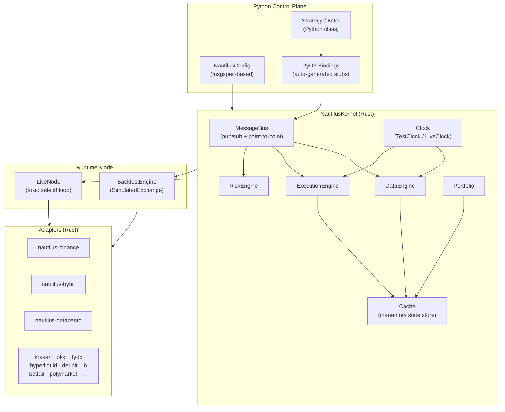
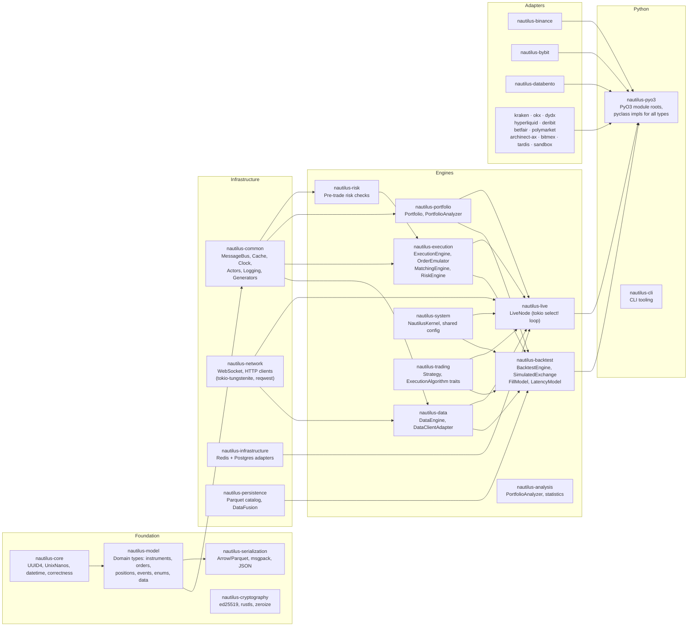

# NautilusTrader — Architecture

> **Last Updated**: 2026-04-07T00:00:00Z
> **Git Hash**: `aa60b11`

## System Architecture

NautilusTrader is built around a single event loop (tokio async runtime) that multiplexes market data events, execution events, trading commands, and timers. The same kernel runs in both backtest and live mode, enforcing identical execution semantics.

---

## Trading Paradigm & Key Features

| Dimension | Approach |
|---|---|
| **Execution model** | Single-threaded async (tokio); `Rc<RefCell<T>>` for shared state — no lock contention |
| **Time model** | Deterministic `UnixNanos` timestamps; `TestClock` in backtest, `LiveClock` in production |
| **Data resolution** | Quote tick, trade tick, order book deltas/depth, bars, custom data — all nanosecond-precise |
| **Order management** | Full lifecycle: emulated orders, order emulator, risk pre-trade checks, execution algorithms |
| **State persistence** | In-memory `Cache`; optional Redis-backed `CacheDatabaseAdapter` for durability |
| **Message routing** | `MessageBus` with typed pub/sub (zero-cost for known types) and `Any`-based routing for Python |
| **Multi-venue** | Strategies subscribe to instruments across venues; `Portfolio` aggregates P&L globally |
| **Precision** | High-precision mode: 128-bit ints, ≤16 decimals; standard: 64-bit, ≤9 decimals |
| **Safety** | Rust borrow checker; Soundness Pledge; supply-chain vetting via `cargo-vet` |
| **Observability** | Structured logging (tracing), optional Postgres/Redis audit trail |

---

## Rust Crate Breakdown

---

## Component Responsibilities

### `nautilus-model` — Domain Model
**Source**: `crates/model/src/`

The foundation of the entire system. Defines all trading domain types shared by every other crate.

| Sub-module | Key Types |
|---|---|
| `orders/` | `LimitOrder`, `MarketOrder`, `StopLimitOrder`, `TrailingStopLimitOrder`, `OrderAny` |
| `position.rs` | `Position` (tracks fills, side, P&L, average price) |
| `enums.rs` | `OrderStatus`, `OrderType`, `OrderSide`, `TimeInForce`, `PositionSide`, `AccountType`, 40+ others |
| `events/order/` | `OrderInitialized`, `OrderSubmitted`, `OrderAccepted`, `OrderFilled`, `OrderCanceled`, … |
| `events/position/` | `PositionOpened`, `PositionChanged`, `PositionClosed` |
| `instruments/` | `CurrencyPair`, `Equity`, `FuturesContract`, `OptionsContract`, `CryptoPerpetual`, … |
| `data/` | `QuoteTick`, `TradeTick`, `Bar`, `OrderBookDeltas`, `OrderBookDepth10` |
| `identifiers/` | `TraderId`, `StrategyId`, `ClientOrderId`, `VenueOrderId`, `InstrumentId`, `PositionId` |
| `types/` | `Price`, `Quantity`, `Money`, `Currency` (fixed-point arithmetic) |

**Source refs**:
- `crates/model/src/enums.rs` — all domain enumerations
- `crates/model/src/orders/mod.rs` — order type registry
- `crates/model/src/position.rs` — position accounting
- `crates/model/src/events/order/` — order event types

---

### `nautilus-common` — Shared Infrastructure
**Source**: `crates/common/src/`

Provides the `MessageBus`, `Cache`, `Clock`, logging, and base traits used by all engines.

- **`MessageBus`** (`msgbus/`): In-process pub/sub + point-to-point. Two routing layers: typed (zero-cost) and `Any`-based (Python interop). Thread-local storage avoids synchronization overhead.
- **`Cache`** (`cache/`): In-memory store for instruments, orders, positions, accounts, and market data. Optionally backed by `CacheDatabaseAdapter` (Redis/Postgres).
- **`Clock`** (`clock.rs`): `TestClock` (deterministic, advance-on-demand) and `LiveClock` (wall-clock). Both implement the same trait so strategies are clock-agnostic.
- **`Actor` / `DataActor`** (`actor/`): Base traits that strategy/actor classes implement to receive data and commands via the `MessageBus`.

**Source refs**:
- `crates/common/src/msgbus/mod.rs` — message bus architecture doc-comment
- `crates/common/src/msgbus/core.rs` — routing core
- `crates/common/src/cache/` — cache implementation
- `crates/common/src/clock.rs` — `Clock` trait and implementations
- `crates/common/src/actor/` — `Actor` base trait

---

### `nautilus-execution` — Order Execution
**Source**: `crates/execution/src/`

| Component | Responsibility |
|---|---|
| `engine/` | `ExecutionEngine` — receives `TradingCommand`s, routes to clients, applies fills |
| `order_emulator/` | Emulates conditional orders (stop triggers, trailing stops) locally before submission |
| `matching_engine/` | `SimulatedMatchingEngine` — used in backtest to match orders against synthetic book |
| `models/` | `FillModel`, `FeeModel`, `LatencyModel` — configurable simulation fidelity |
| `reconciliation.rs` | Reconciles live order/position state with venue |

**Source refs**:
- `crates/execution/src/engine/` — execution engine
- `crates/execution/src/order_emulator/` — local order emulation
- `crates/execution/src/matching_engine/` — backtest order matching

---

### `nautilus-backtest` — Backtest Engine
**Source**: `crates/backtest/src/`

Wraps `NautilusKernel` for historical replay. Drives `SimulatedExchange` instances with configurable fill/fee/latency models. Processes data via a chronological `BacktestDataIterator` and accumulates time events through `TimeEventAccumulator`.

**Source refs**:
- `crates/backtest/src/engine.rs` — `BacktestEngine` struct and `run()` method
- `crates/backtest/src/exchange.rs` — `SimulatedExchange`
- `crates/backtest/src/node.rs` — `BacktestNode` (multi-run orchestration)

---

### `nautilus-live` — Live Trading Node
**Source**: `crates/live/src/`

`LiveNode` drives the system through a `tokio::select!` loop multiplexing data events, execution events, trading commands, timers, and periodic maintenance tasks (reconciliation, purge, prune). All core types use `Rc<RefCell<T>>` and are `!Send` — single-threaded design eliminates lock contention.

**Source refs**:
- `crates/live/src/node.rs` — live node architecture and startup sequence
- `crates/live/src/runner.rs` — event loop runner
- `crates/live/src/manager.rs` — execution manager

---

### `nautilus-pyo3` — Python Bindings
**Source**: `crates/pyo3/`

Aggregates all `#[pyclass]` and `#[pymodule]` definitions from across the crate workspace into the top-level `nautilus_trader.core.nautilus_pyo3` extension module. Type stubs (`.pyi`) are auto-generated by `pyo3-stub-gen`.

**Source refs**:
- `crates/pyo3/` — PyO3 module root
- `nautilus_trader/__init__.py` — Python package entry point
- `nautilus_trader/trading/strategy.pyx` — Cython strategy base (legacy, being migrated to Rust)
