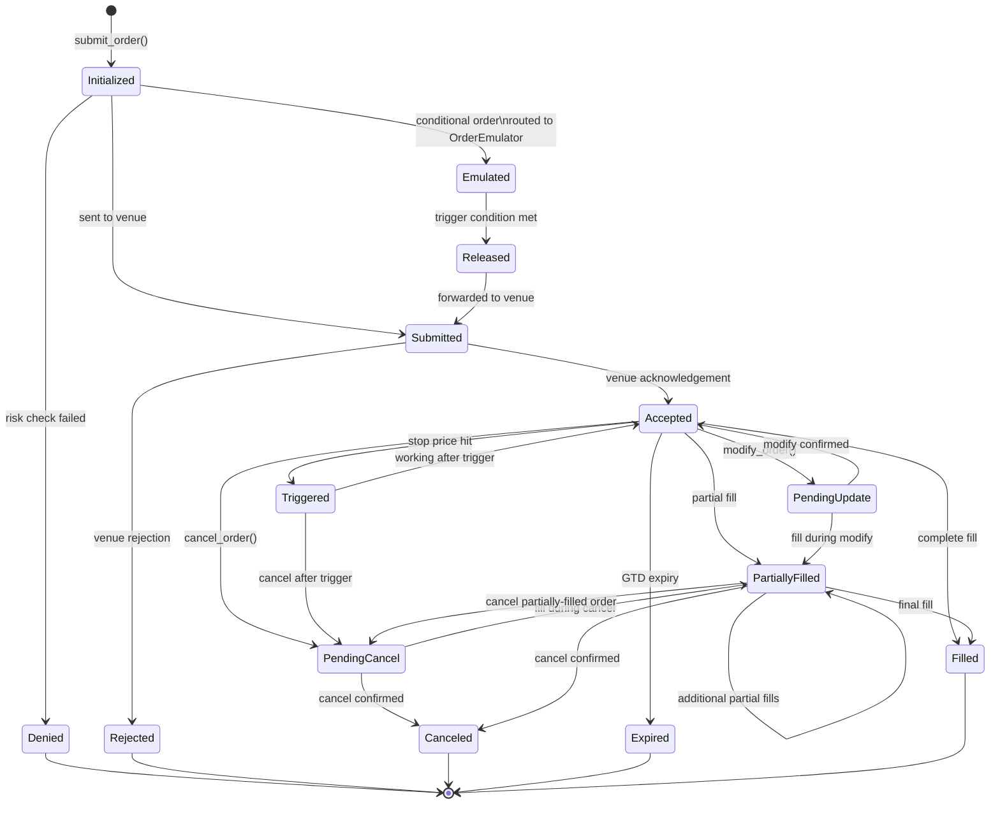
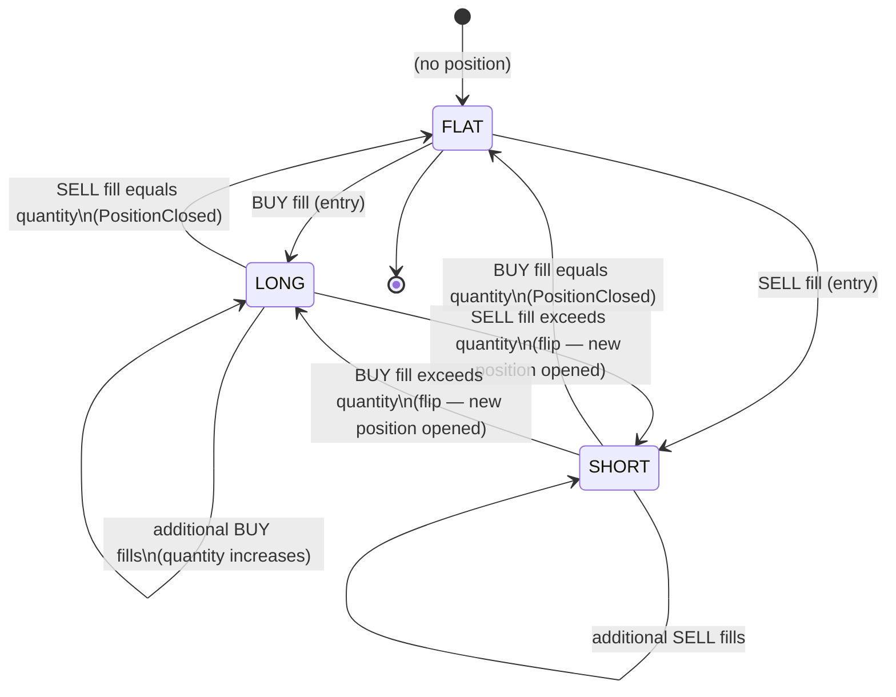

# NautilusTrader — State Management

> **Last Updated**: 2026-04-07T00:00:00Z
> **Git Hash**: `aa60b11`

## Order State Machine

Every order in NautilusTrader follows a strict state machine enforced in Rust. States are defined in `crates/model/src/enums.rs` (`OrderStatus` enum, lines 1266–1295).

### Open vs Closed States

The `OrderStatus` type provides helper predicates:

| Predicate | States |
|---|---|
| `is_open()` | `Submitted`, `Accepted`, `Triggered`, `PendingUpdate`, `PendingCancel`, `PartiallyFilled` |
| `is_closed()` | `Denied`, `Rejected`, `Canceled`, `Expired`, `Filled` |
| `is_cancellable()` | `Accepted`, `Triggered`, `PendingUpdate`, `PartiallyFilled` |

`PendingCancel` is intentionally excluded from `is_cancellable()` to prevent duplicate cancel attempts.

**Source ref**: `crates/model/src/enums.rs` lines 1297–1356

---

## Order Types and Their State Paths

| Order Type | Notes |
|---|---|
| `MarketOrder` | `Initialized → Submitted → Accepted → Filled` (fast path, no resting) |
| `LimitOrder` | Can rest in `Accepted`; fills partially or fully |
| `StopMarketOrder` | Enters `Accepted` then `Triggered → Submitted → Accepted → Filled` |
| `StopLimitOrder` | Same as StopMarket but converts to limit after trigger |
| `MarketToLimitOrder` | Submitted as market, converts to limit at best price |
| `LimitIfTouchedOrder` | Similar to StopLimit; triggers when price touches level |
| `TrailingStopMarketOrder` | Stop price trails last price by offset; dynamically updated |
| `TrailingStopLimitOrder` | Trailing stop that converts to limit order |

**Contingency orders** (OCO/OUO/OTO) are implemented via `OrderList` — linked orders that react to each other's fills/cancels.

**Source refs**:
- `crates/model/src/orders/` — all order type implementations
- `crates/execution/src/order_emulator/` — conditional trigger logic
- `crates/model/src/orders/list.rs` — `OrderList` (contingency groups)

---

## Position Lifecycle

A `Position` is created on the first fill of an order and updated with each subsequent fill. It is closed when net quantity returns to zero.

### Position Fields

The `Position` struct (`crates/model/src/position.rs`) tracks:

| Field | Description |
|---|---|
| `side` | Current `PositionSide` (LONG / SHORT / FLAT) |
| `quantity` | Absolute open quantity |
| `signed_qty` | Signed quantity (+long / -short) for DeFi/margin math |
| `peak_qty` | Maximum quantity held (for risk reporting) |
| `entry` | Entry `OrderSide` (BUY / SELL) |
| `opening_order_id` | `ClientOrderId` that opened the position |
| `closing_order_id` | `ClientOrderId` that closed the position (if closed) |
| `events` | All `OrderFilled` events that created/changed this position |
| `avg_px_open` | Volume-weighted average entry price |
| `avg_px_close` | Volume-weighted average exit price |
| `realized_pnl` | Realized P&L (settled) |
| `unrealized_pnl(price)` | Unrealized P&L at a given mark price |

**Source ref**: `crates/model/src/position.rs`

---

## Account State

NautilusTrader supports three account types:

| Type | Description | Source |
|---|---|---|
| `Cash` | Unleveraged; assets only | `crates/model/src/accounts/` |
| `Margin` | Leveraged trading with collateral | `crates/model/src/accounts/` |
| `Betting` | Betting exchange accounts | `crates/model/src/accounts/` |

Account state is maintained in the `Cache` and updated on every `OrderFilled` event. The `Portfolio` component aggregates across accounts:

- **Net position** per instrument across all accounts
- **Unrealized P&L** using current mark prices from the `Cache`
- **Realized P&L** from closed positions
- **Commission** tracking per fill

The `PortfolioAnalyzer` (`crates/analysis/`) computes performance statistics (Sharpe ratio, max drawdown, win rate, etc.) from the portfolio's P&L history.

**Source refs**:
- `crates/model/src/accounts/` — account type implementations
- `crates/portfolio/src/` — `Portfolio` aggregation
- `crates/analysis/` — `PortfolioAnalyzer`

---

## Cache — Single Source of Truth

The `Cache` (`crates/common/src/cache/`) is the central in-memory state store. All components read from and write to the cache via the `MessageBus`.

Key collections maintained by the Cache:

| Collection | Contents |
|---|---|
| `instruments` | All subscribed `InstrumentAny` keyed by `InstrumentId` |
| `orders` | All `OrderAny` keyed by `ClientOrderId` |
| `positions` | All `Position` keyed by `PositionId` |
| `accounts` | All accounts keyed by `AccountId` |
| `quotes` | Latest `QuoteTick` per `InstrumentId` |
| `trades` | Latest `TradeTick` per `InstrumentId` |
| `bars` | Latest `Bar` per `(InstrumentId, BarType)` |
| `order_books` | `OrderBook` per `InstrumentId` |

Optional `CacheDatabaseAdapter` persists the cache to Redis on writes and loads it on startup, enabling crash recovery and state rehydration.

**Source refs**:
- `crates/common/src/cache/` — `Cache` implementation
- `crates/infrastructure/src/` — Redis/Postgres `CacheDatabaseAdapter`

---

## See Also

- [`workflow.md`](workflow.md) — event lifecycle and data flow diagrams
- [`architecture.md`](architecture.md) — system component breakdown
- [`concepts/`](concepts/) — upstream docs on orders, cache, message bus
- [`api_reference/`](api_reference/) — full Python API for `Order`, `Position`, `Portfolio`
