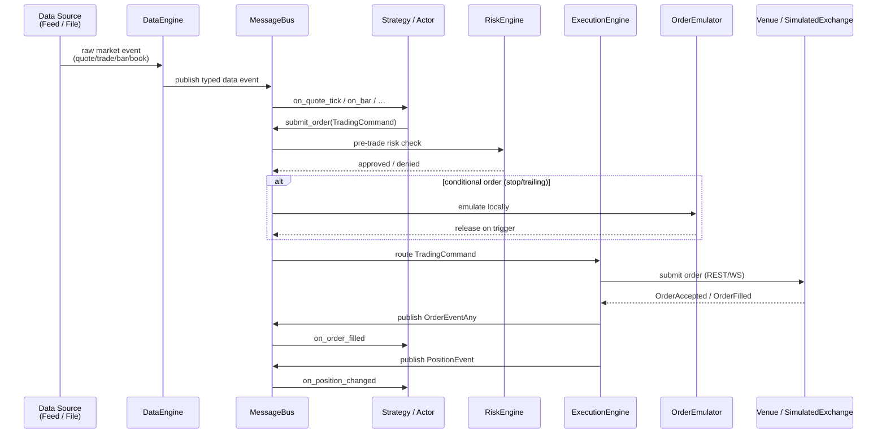
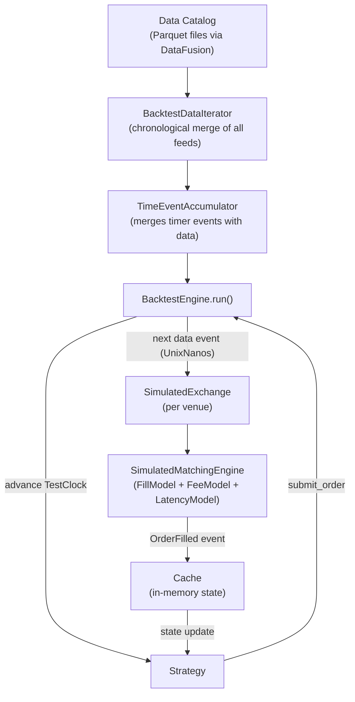
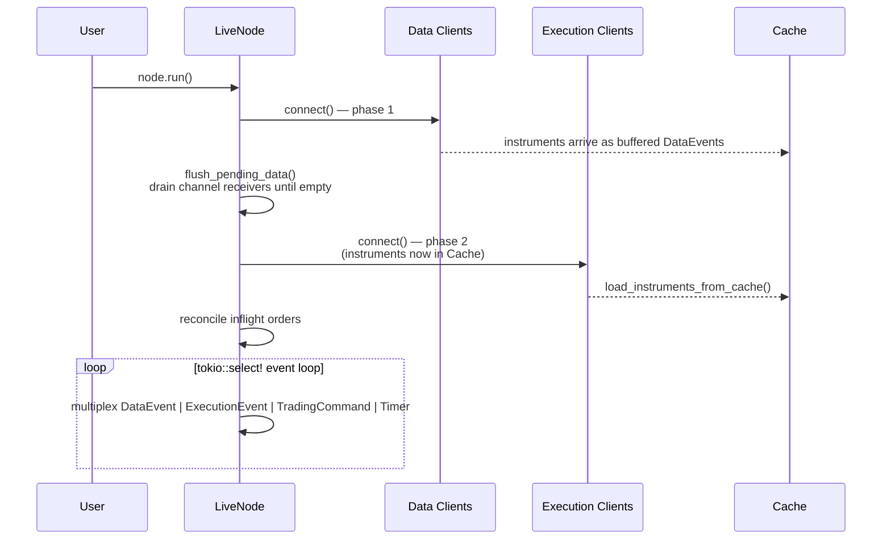

# NautilusTrader — Workflow

> **Last Updated**: 2026-04-07T00:00:00Z
> **Git Hash**: `aa60b11`

## Trading Pipeline Overview

The following sequence diagram shows the complete path from strategy signal to fill confirmation, which is identical in both backtest and live modes.



**Source refs**:
- `crates/common/src/msgbus/mod.rs` — message bus routing
- `crates/execution/src/engine/` — execution engine command handling
- `crates/risk/src/` — risk engine pre-trade checks
- `crates/execution/src/order_emulator/` — conditional order emulation

---

## Backtest Data Flow



Key design properties:
- All events are processed in **strict nanosecond chronological order**.
- The `TestClock` is advanced to exactly the `ts_event` of each data point, ensuring strategies see realistic time when querying `clock.timestamp_ns()`.
- `SimulatedExchange` maintains a synthetic order book and applies configurable `FillModel` (probabilistic fill) and `LatencyModel` (simulated round-trip delay).
- Multiple venues and instruments run simultaneously in a single engine pass.

**Source refs**:
- `crates/backtest/src/engine.rs` — `BacktestEngine::run_sync()`
- `crates/backtest/src/data_iterator.rs` — chronological data merge
- `crates/backtest/src/accumulator.rs` — time-event accumulation
- `crates/backtest/src/exchange.rs` — `SimulatedExchange`
- `crates/execution/src/models/` — fill, fee, latency models

---

## Live Trading Startup Sequence



The two-phase startup ensures instruments are in the `Cache` before execution clients attempt to load them, avoiding a race condition between data and execution subscriptions.

**Source ref**: `crates/live/src/node.rs` — startup sequencing doc-comment

---

## Event Lifecycle

Every state change in the system flows through an **event** published on the `MessageBus`. Events are immutable value objects carrying `ts_event` (when it happened on the venue) and `ts_init` (when it was created in the system).

```
Order Events
├── OrderInitialized       — strategy calls submit_order()
├── OrderDenied            — risk check failed
├── OrderEmulated          — routed to OrderEmulator
├── OrderReleased          — conditional trigger fired
├── OrderSubmitted         — sent to venue
├── OrderAccepted          — venue acknowledgement
├── OrderRejected          — venue rejected
├── OrderTriggered         — stop price hit (stop orders)
├── OrderPendingUpdate     — modify request in-flight
├── OrderPendingCancel     — cancel request in-flight
├── OrderCanceled          — cancel confirmed
├── OrderExpired           — GTD expiry
├── OrderPartiallyFilled   — partial fill received
└── OrderFilled            — complete fill received

Position Events
├── PositionOpened         — first fill opens a position
├── PositionChanged        — subsequent fills modify quantity/side
└── PositionClosed         — net quantity reaches zero
```

**Source refs**:
- `crates/model/src/events/order/` — order event structs
- `crates/model/src/events/position/` — position event structs
- `crates/model/src/enums.rs` — `OrderStatus` enum (lines 1266–1295)

---

## See Also

- [`architecture.md`](architecture.md) — crate breakdown and component responsibilities
- [`state-management.md`](state-management.md) — order state machine and position lifecycle
- [`concepts/`](concepts/) — upstream docs on message bus, cache, actors
- [`getting_started/`](getting_started/) — first strategy walkthrough
